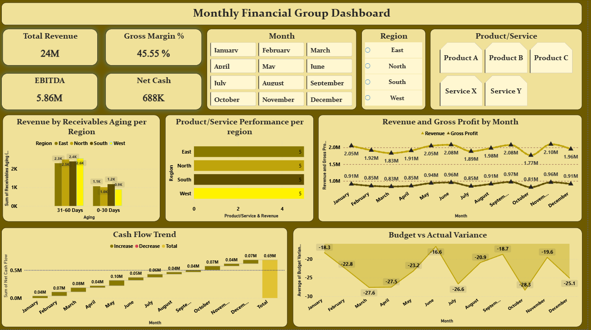

# Executive Financial & Operations Analytics Hub

## Project Context
Welcome to the portfolio repository for the Executive Financial Performance Dashboard, developed specifically for The Finance Group. This Power BI solution centralizes disparate financial datasets into a single, interactive environment. By merging cash flow tracking, budget variance, product profitability, and revenue generation into one cohesive tool, this project equips senior leadership with the visibility required to monitor overarching fiscal health and operational agility.

## The Business Problem Statement
The Finance Group was struggling with siloed monthly reporting. Crucial metrics across Profit & Loss statements, Accounts Receivable/Payable aging, Cash Flow, and Sales were housed in separate domains. The executive team needed a unified, dynamic tracking solution. The goal was to build a centralized architecture that enabled instant cross-filtering by date, product category, and geographic region, allowing stakeholders to bypass manual data aggregation and immediately spot operational bottlenecks or working capital risks.

## Analytical Workflow & Data Modeling

> Use File `Financial.pbix`

To generate reliable, executive-grade insights, I executed a strict data transformation and modeling pipeline:

* **Data Standardization:** Cleaned and formatted raw financial logs, ensuring all monthly reporting periods were strictly closed out. Standardized all aging data into precise, end-of-month snapshots.
* **Core Financial Calculations:** Programmed underlying calculations for foundational metrics, directly deriving Net Cash Flow from inflows/outflows and computing EBITDA by stripping Operating Expenses from Gross Profit.
* **DAX Variance Engineering:** Formulated complex DAX measures to calculate the Budget vs. Actual Variance percentage. This normalized metric allows leadership to immediately contextualize systematic over- or under-performance across any filtered region or timeframe.
* **Liquidity & Trend Profiling:** Mapped the historical spread between raw Revenue and EBITDA to expose the drag of Operating Expenses over time. Additionally, translated continuous receivables data into categorical risk buckets to accurately assess liquidity threats.

## Dashboard Architecture
The final Power BI deliverable is fully interactive, featuring deep drill-down mechanics and cross-filtering capabilities. It guides the user from high-level macroeconomic summaries down to specific operational line items. 

Core visual components include:
* **Executive KPI Banners:** High-level cards tracking Total Revenue, EBITDA margins, Gross Margin %, and Net Cash positions.
* **Profitability Time-Series:** A longitudinal chart mapping monthly Revenue alongside Gross Profit and EBITDA, revealing how effectively top-line sales translate into bottom-line profits.
* **Variance Tracking:** A dedicated visual mapping actual performance against corporate budget targets to highlight regional anomalies.

* **Product Performance Matrix:** A dual-axis chart evaluating services by both Gross Profit and Revenue, easily separating high-margin "heroes" from volume-heavy "loss leaders."
* **Accounts Receivable Aging:** Categorical risk distribution of outstanding invoices, providing immediate visibility into trapped working capital.

* **Cash Flow Waterfall:** A sequential breakdown visualizing the exact inflows and outflows bridging the opening and closing net cash positions.

## Strategic Recommendations

> Use File `The_Financial_Group_Report.pdf`

Based on the robust financial modeling and dashboard insights, I propose the following strategic directives to the leadership team:

* **Reel in Operating Expenses (OpEx):** The trend analysis clearly indicates that OpEx is taking a significant bite out of profitability, even during high-revenue months. Leadership must audit operational spending to ensure costs are scaling efficiently with sales growth, rather than eroding margins.
* **Root-Cause Variance Analysis:** The Budget Variance metrics explicitly flag certain regions for chronic underperformance. Management should use these flags to conduct targeted reviews, determining whether the shortfalls are due to poor localized execution or flawed initial forecasting.
* **Aggressive Working Capital Recovery:** The regional Receivables Aging data highlights specific territories where cash is dangerously bottlenecked in the sales cycle. To immediately boost liquidity, the business must implement stricter invoice collection policies and proactively renegotiate payment terms in those identified problem regions.
